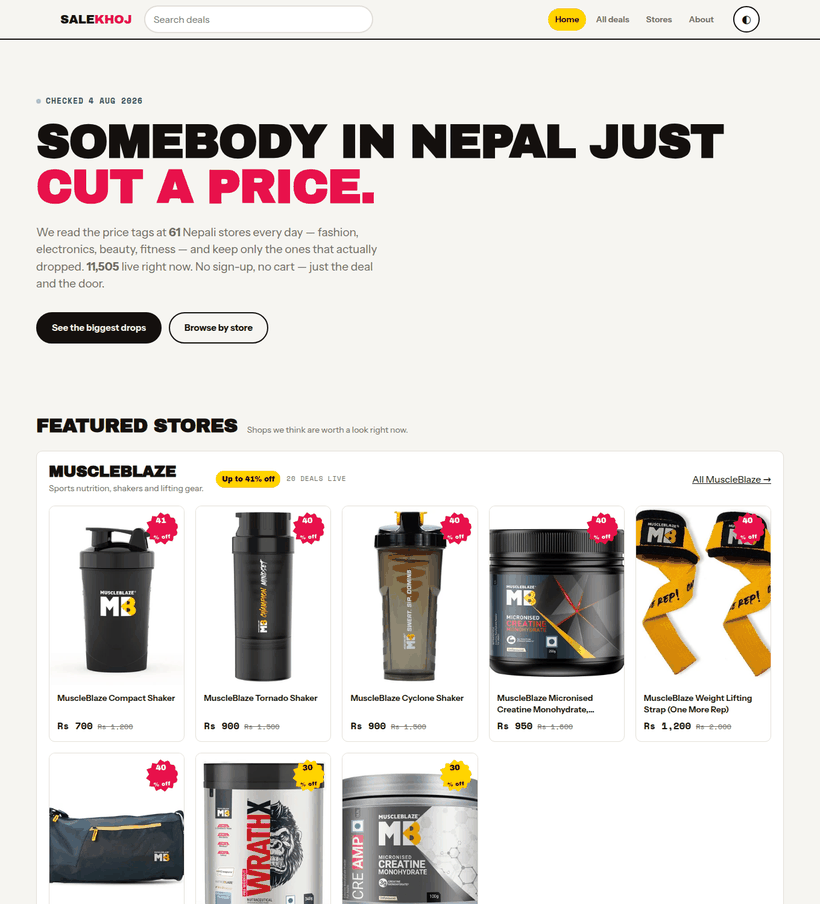
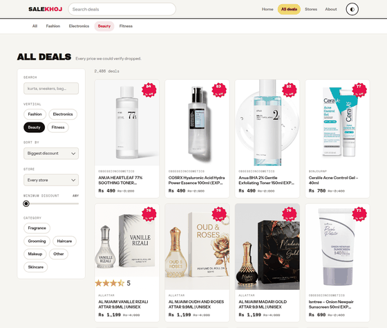
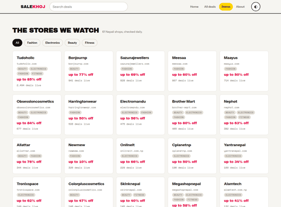
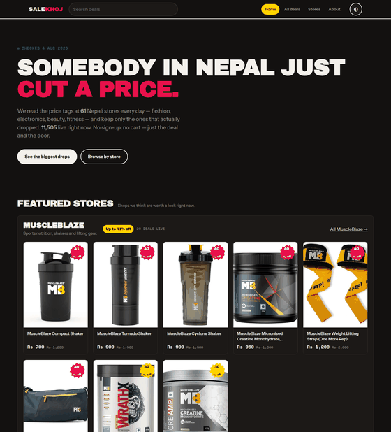
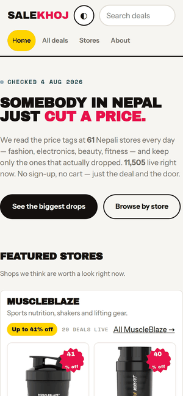

<div align="center">

# SaleKhoj

**Every live sale in Nepal, on one page.**

Scrapers read each store's own product feed, keep only the prices that actually dropped,
and write a static JSON the site reads. No database, no server, no framework.

[**salekhoj →**](https://sushi057.github.io/salekhoj/)

[](https://github.com/sushi057/salekhoj/actions/workflows/refresh.yml)



</div>

---

## What it is

211 Nepali online shops get probed on every build. The ones that publish a machine-readable
product feed get read, filtered down to genuine markdowns, and merged into one browsable list —
currently **~11,000 live deals from ~55 contributing stores** across fashion, electronics, beauty
and fitness.

You get the deal and the door. No sign-up, no cart, no cashback account, no notification spam.
Every card shows the current price next to the original, and links straight to the shop.

## Screenshots

| Filterable deal list | Store directory |
|---|---|
|  |  |

| Dark mode | Mobile |
|---|---|
|  |  |

Theme follows your OS, with a manual override that sticks.

## What counts as a deal

**Two prices or it doesn't exist.** The store must publish a current price *and* a higher
original price. Nothing is ever inferred from a "SALE" badge, and no percentage is guessed.
See `deal()` in `scrapers/extract.py`.

**The discount band is 5–85%**, floor-rounded because that's how shops label it. The ceiling is
85% rather than 90% for a specific reason: above it the data is dominated by decimal-shift typos
in store compare-at prices — one shop listed a Rs 77,000 laptop as Rs 760,000, producing a fake
"90% off". That costs a few genuine clearances. Publishing a fake headline number is the worse
failure.

**Nepal-based only.** Shopify's `/meta.json` declares a store's country and currency, so that's
the gate: `NP` + `NPR`. This deliberately drops brands that are Nepali in spirit but sell abroad
in USD/INR/EUR — a shopper in Kathmandu can't act on those. Flip `NPR_ONLY` in `extract.py` to
include them.

**No signal means the product is dropped.** `all_sites.txt` tags each domain with a vertical,
but that's a *hint*: the product's own title and category decide. The hint only breaks ties and
disambiguates words that mean different things per store ("case", "cover", "strap"). Falling
back to the hint alone once filed a pressure washer under Fitness and a jewelry box under
Beauty, so it no longer happens.

## How it works

```
scrapers/all_sites.txt      211 domains, domain<TAB>vertical
         │
         ▼
scrapers/fingerprint.py     probe each domain, sort into tiers  ──▶  data/sites.json
         │
         ▼
scrapers/extract.py         read feeds, classify, keep real markdowns
         │                                    │
         ▼                                    ▼
    site/data.json                     data/coverage.md
         │
         ▼
    site/  ── 5 static pages, vanilla JS, no build step
```

| Tier | Meaning | Status | Count |
|---|---|---|---|
| 1 | Shopify `/products.json` or WooCommerce Store API | working, zero per-site code | 105 |
| 2 | Prices in HTML: sitemap → JSON-LD price + struck original | working, zero per-site selectors | 45 |
| 3 | JS-rendered or blocking, needs a real browser | not built | 53 |

Three extractors cover every tier-1 and tier-2 site with no per-site code at all. Tier 2 trusts
only structured markup for the current price and only genuinely struck-through text for the
original — never loose page text.

## Coverage, including the failures

`data/coverage.md` is regenerated by every build: one row per domain with tier, platform,
detected country/currency, products seen vs kept, and **a specific reason for every zero** —
`dead/unreachable`, `not Nepal-based (country=US)`, `no structured feed`, `feed OK but zero
discounts right now`. Zero-yield sites are grouped by reason so it's obvious where the next
hour of work pays off. Never hand-edit it.

Counts move between runs. Nepali hosting is slow and flaky — maayus.com went 718 deals one day
and "dead" the next. The coverage report is how you tell real decay from noise.

## Run it locally

```sh
python3 -m http.server 8811 -d site      # the site, at localhost:8811
```

`site/data.json` is committed, so the frontend runs immediately — you do **not** need to scrape
anything to work on the UI.

To rebuild the data from the live stores (hits the network, takes several minutes):

```sh
./build.sh
python3 scrapers/extract.py --check      # logic self-check, also runs inside build.sh
```

Python 3 standard library only. No pip install, no virtualenv, no lockfile.

## How the data stays fresh

A [scheduled workflow](.github/workflows/refresh.yml) rebuilds from the live stores every
morning and publishes to GitHub Pages.

The interesting part is `scrapers/gate.py`. Nepali hosts fail unpredictably, so an unattended
job will eventually run on a day when a third of them time out and cheerfully publish a site
missing half its deals. The gate compares each fresh build against the last accepted one and
**refuses to deploy** if deals fall below 70% or contributing stores below 80%:

```
new build: 5752 deals from 55 domains
last good: 11505 deals from 61 domains
ratio: deals 50%, domains 90%
FAIL  deals fell to 50% of last good (floor 70%)
Refusing to publish. The live site keeps the previous data.
```

A failed gate fails the workflow, which emails the repo owner and leaves yesterday's data live.
Re-run with `force: true` when a drop turns out to be real.

`site/data.json` is deliberately **not** committed by CI — 5 MB of single-line JSON committed
daily would add ~300 MB/year of git history. CI builds it fresh and ships it straight to Pages
as an artifact.

## Tests

```sh
python3 -m http.server 8811 -d site &
node scrapers/playtest.js
```

60 headless checks (puppeteer-core + a cached Chrome) covering desktop, mobile at 360/390/430,
dark mode, SEO tags, and layout stability. Every real bug in this project was found by looking
at a rendered page or a data sample — never by reading code — so UI and scraper changes are
expected to be verified by running them.

## Adding a store

Add one line to `scrapers/all_sites.txt`:

```
somestore.com.np	Fashion
```

Then run `./build.sh` and check the store's row in `data/coverage.md`. If it lands in tier 3 or
reports a non-NP country, that's the answer for why it contributes nothing — both are honest
outcomes, not bugs to work around.

## Money

None yet, by decision. Outbound links are plain links. Affiliate links may come later, and they
will be labelled when they do. **The sort order is never sold** — the sort you pick is the sort
you get.

## Licence

MIT — see [LICENSE](LICENSE).
